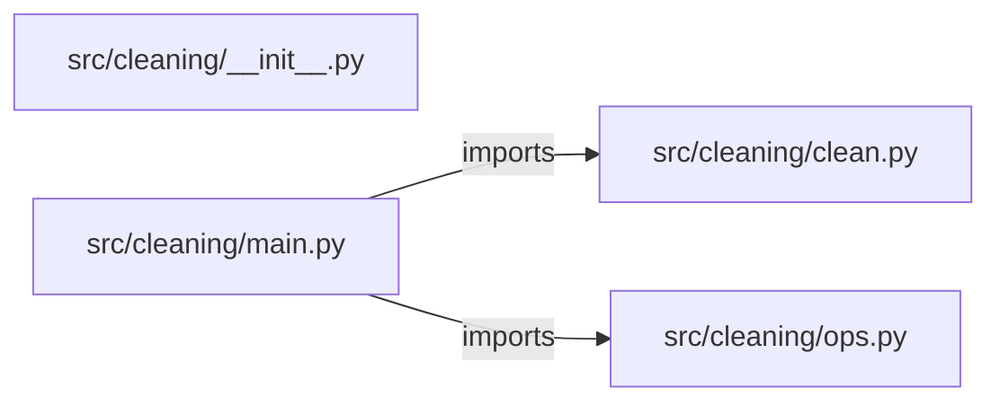

# data-cleaning-tool — project architecture

[README](README.md) · [Interview questions and answers](INTERVIEW_QA.md)

## Purpose and scope

Send rows as JSON objects. The tool cleans a copy and returns the cleaned rows with a report of every kind of change. The input is never modified.

This document describes files and symbols in this checkout. Deployment templates and statements in the original overview are distinguished from a verified running environment.

## Component diagram



For Python repositories, arrows show resolved local imports, not network calls or deployment order. Otherwise the diagram is a repository component map; containment arrows do not assert runtime integration.

## Components and responsibilities

| Component | Responsibility |
| --- | --- |
| [`src/cleaning/main.py`](src/cleaning/main.py) | HTTP handlers: `GET /healthz`, `POST /clean` |
| [`src/cleaning/ops.py`](src/cleaning/ops.py) | HTTP handlers: `GET /readyz`, `POST /workspaces`, `GET /workspaces`, `POST /workspaces/{workspace_id}/jobs`, `GET /jobs/{job_id}` |
| [`src/cleaning/clean.py`](src/cleaning/clean.py) | Functions: `snake`, `coerce`, `iso_date`, `median`, `quartiles`, `clean` |
| [`requirements.txt`](requirements.txt) | Implementation or supporting configuration |
| [`src/cleaning/__init__.py`](src/cleaning/__init__.py) | Implementation or supporting configuration |
| [`Dockerfile`](Dockerfile) | Container build/service configuration |
| [`Makefile`](Makefile) | Implementation or supporting configuration |
| [`docker-compose.yml`](docker-compose.yml) | Container build/service configuration |
| [`tests/test_clean.py`](tests/test_clean.py) | Executable checks and regression examples |
| [`tests/test_ops.py`](tests/test_ops.py) | Executable checks and regression examples |
| [`.github/workflows/ci.yml`](.github/workflows/ci.yml) | GitHub Actions job definitions |
| [`README.md`](README.md) | Project explanations or operating notes |
| [`docs/ARCHITECTURE.md`](docs/ARCHITECTURE.md) | Project explanations or operating notes |

## Existing design and operating guides

These checked-in guides provide the project’s detailed design, operational context, or deployment view:

- [`docs/ARCHITECTURE.md`](docs/ARCHITECTURE.md).

## Request interface

| Method and path | Handler | Source |
| --- | --- | --- |
| `GET /healthz` | `healthz` | [`src/cleaning/main.py`](src/cleaning/main.py#L19) |
| `POST /clean` | `post_clean` | [`src/cleaning/main.py`](src/cleaning/main.py#L24) |
| `GET /readyz` | `readyz` | [`src/cleaning/ops.py`](src/cleaning/ops.py#L44) |
| `POST /workspaces` | `create_workspace` | [`src/cleaning/ops.py`](src/cleaning/ops.py#L49) |
| `GET /workspaces` | `list_workspaces` | [`src/cleaning/ops.py`](src/cleaning/ops.py#L66) |
| `POST /workspaces/{workspace_id}/jobs` | `create_job` | [`src/cleaning/ops.py`](src/cleaning/ops.py#L73) |
| `GET /jobs/{job_id}` | `get_job` | [`src/cleaning/ops.py`](src/cleaning/ops.py#L96) |
| `POST /jobs/{job_id}/approve` | `approve_job` | [`src/cleaning/ops.py`](src/cleaning/ops.py#L105) |
| `GET /audit` | `audit` | [`src/cleaning/ops.py`](src/cleaning/ops.py#L122) |
| `GET /metrics` | `metrics` | [`src/cleaning/ops.py`](src/cleaning/ops.py#L138) |

The table lists literal route decorators found in the inspected Python modules. Router prefixes and middleware can add behavior; check the linked handler and application setup before calling an endpoint.

## Implementation walkthrough

### `clean(rows, fill='median', date_columns=(), flag_outliers=True)`

Source: [`src/cleaning/clean.py`](src/cleaning/clean.py#L56).

Calls visible in this function: `', '.join`, `CleaningError`, `all`, `any`, `coerce`, `copy.deepcopy`, `dict.fromkeys`, `enumerate`, `isinstance`, `iso_date`, `len`, `list`.

```python
def clean(rows, fill="median", date_columns=(), flag_outliers=True):
    if fill not in STRATEGIES:
        raise CleaningError(f"fill must be one of {', '.join(sorted(STRATEGIES))}")
    if not isinstance(rows, list) or not all(isinstance(row, dict) for row in rows):
        raise CleaningError("rows must be a list of objects")
    original = copy.deepcopy(rows)
    report = {"renamed": {}, "dropped_duplicates": 0, "stripped": 0, "coerced": 0, "dates": 0, "filled": 0, "dropped_missing": 0, "outliers": []}

    renamed_rows = []
    for row in rows:
        renamed = {}
        for key, value in row.items():
            new_key = snake(key)
            if new_key != key:
                report["renamed"][key] = new_key
            renamed[new_key] = value
        renamed_rows.append(renamed)

    for row in renamed_rows:
        for key, value in list(row.items()):
            if isinstance(value, str) and value != value.strip():
                row[key] = value.strip()
```

The excerpt is truncated; the linked source contains the full implementation.

### `iso_date(value)`

Source: [`src/cleaning/clean.py`](src/cleaning/clean.py#L29).

Calls visible in this function: `datetime.strptime`, `datetime.strptime(value.strip(), fmt).date`, `datetime.strptime(value.strip(), fmt).date().isoformat`, `isinstance`, `value.strip`.

```python
def iso_date(value):
    if not isinstance(value, str):
        return None
    for fmt in DATE_FORMATS:
        try:
            return datetime.strptime(value.strip(), fmt).date().isoformat()
        except ValueError:
            continue
    return None
```

### `coerce(value)`

Source: [`src/cleaning/clean.py`](src/cleaning/clean.py#L19).

Calls visible in this function: `float`, `int`, `isinstance`, `re.fullmatch`, `value.strip`, `value.strip().replace`.

```python
def coerce(value):
    if isinstance(value, str):
        stripped = value.strip().replace(",", "")
        if re.fullmatch(r"-?\d+", stripped):
            return int(stripped)
        if re.fullmatch(r"-?\d*\.\d+", stripped):
            return float(stripped)
    return value
```

### `median(values)`

Source: [`src/cleaning/clean.py`](src/cleaning/clean.py#L40).

Calls visible in this function: `len`, `sorted`.

```python
def median(values):
    ordered = sorted(values)
    middle = len(ordered) // 2
    if len(ordered) % 2:
        return ordered[middle]
    return (ordered[middle - 1] + ordered[middle]) / 2
```

## Validation and failure paths

| Explicit exception | Source |
| --- | --- |
| `CleaningError(f"fill must be one of {', '.join(sorted(STRATEGIES))}")` | [`src/cleaning/clean.py`](src/cleaning/clean.py#L58) |
| `CleaningError('rows must be a list of objects')` | [`src/cleaning/clean.py`](src/cleaning/clean.py#L60) |
| `CleaningError('input rows were modified')` | [`src/cleaning/clean.py`](src/cleaning/clean.py#L139) |
| `CleaningError(f'{column} has a value that is not a known date format: {row[key]}')` | [`src/cleaning/clean.py`](src/cleaning/clean.py#L93) |
| `HTTPException(status_code=422, detail=str(exc))` | [`src/cleaning/main.py`](src/cleaning/main.py#L28) |
| `HTTPException(status_code=404, detail='workspace not found')` | [`src/cleaning/ops.py`](src/cleaning/ops.py#L77) |
| `HTTPException(status_code=404, detail='job not found')` | [`src/cleaning/ops.py`](src/cleaning/ops.py#L100) |
| `HTTPException(status_code=404, detail='job not found')` | [`src/cleaning/ops.py`](src/cleaning/ops.py#L109) |
| `HTTPException(status_code=403, detail='production apply is disabled in this lab')` | [`src/cleaning/ops.py`](src/cleaning/ops.py#L113) |

These are explicit exceptions in the inspected source, rather than a claim that every failure is handled. Follow the calling handler to see whether the exception becomes an HTTP response or propagates.

## Data and state

- [`src/cleaning/clean.py`](src/cleaning/clean.py) defines module-level containers: `STRATEGIES`.
- [`src/cleaning/ops.py`](src/cleaning/ops.py) defines module-level containers: `_WORKSPACES`, `_JOBS`, `_AUDIT`, `_METRICS`.

Module-level dictionaries/lists live in a Python process. They can be fixtures or mutable state; inspect writes before treating them as persistent storage. A production extension would need to define persistence and concurrency behavior explicitly.

## Data flow and design decisions

### What is the input-to-output contract of `clean`

In [`src/cleaning/clean.py`](src/cleaning/clean.py#L56), `clean(rows, fill='median', date_columns=(), flag_outliers=True)` receives the inputs. The function computes these intermediate values:

- `original = copy.deepcopy(rows)`
- `report = {'renamed': {}, 'dropped_duplicates': 0, 'stripped': 0, 'coerced': 0, 'dates': 0, 'filled': 0, 'dropped_missing': 0, 'outliers': []}`
- `renamed_rows = []`
- `unique = []`
- `keys = list(dict.fromkeys((key for row in unique for key in row)))`
- `numeric = [key for key in keys if any((isinstance(row.get(key), (int, float)) and (not isinstance(row.get(key), bool)) for row in unique))]`

Its result is defined by:

- `{'rows': unique, **report}`

### Which decision rules or boundary conditions should an interviewer challenge

The implementation in [`src/cleaning/clean.py`](src/cleaning/clean.py#L56) branches on:

- `fill not in STRATEGIES`
- `not isinstance(rows, list) or not all((isinstance(row, dict) for row in rows))`
- `fill == 'drop'`
- `flag_outliers`
- `rows != original`
- `row in unique`
- `fill != 'none'`

A useful extension is a table-driven test that covers each condition just below, at, and above its boundary where applicable. These expressions are the current rules; changing them changes behavior and should be justified by the project’s acceptance criteria.

### What does the operations plane add, and where is its limit

[`src/cleaning/ops.py`](src/cleaning/ops.py) declares `GET /readyz`, `POST /workspaces`, `GET /workspaces`, `POST /workspaces/{workspace_id}/jobs`, `GET /jobs/{job_id}`, `POST /jobs/{job_id}/approve`, `GET /audit`, `GET /metrics`. Inspect the application’s `include_router` call for its URL prefix.

Its state containers are `_WORKSPACES`, `_JOBS`, `_AUDIT`, `_METRICS`. The job-approval handler defines whether a target is accepted or refused; check that branch and the associated tests instead of treating a recorded job as a successful infrastructure apply.

## Setup and verification

The following commands are derived from the checked-in dependency/test contracts. Execute them from the repository root; the block prepares a local environment, not a cloud deployment.

```bash
python3 -m venv .venv
source .venv/bin/activate
python -m pip install -r requirements.txt
python -m pytest -q
```

Python dependencies: [`requirements.txt`](requirements.txt).

Test entry points: [`tests/test_clean.py`](tests/test_clean.py), [`tests/test_ops.py`](tests/test_ops.py).

Automation definitions: [`.github/workflows/ci.yml`](.github/workflows/ci.yml). Read their triggers and job steps to determine what CI actually runs.

## Operating boundaries and design review

Before turning this checkout into a customer deployment, establish the input contract, data ownership, access controls, failure response, evaluation criteria, and rollback owner. Repository fixtures and unit tests demonstrate local behavior; they do not establish throughput, uptime, compliance, or business impact.

A useful architecture review starts with the linked implementation: identify where input enters, where a decision is made, which state can change, and which external dependency can fail. Add a deployment view only for infrastructure that is actually configured and exercised.
